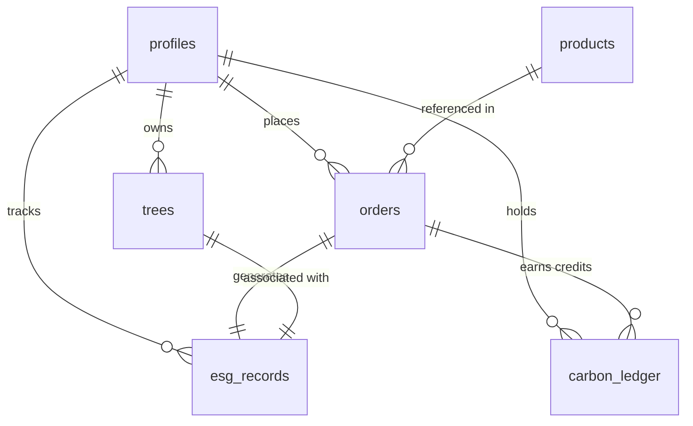

# EkoKintsugi — Developer Onboarding & Starter Guide

Welcome to **EkoKintsugi**! This guide is designed to help any developer get up to speed with the architecture, database schema, core feature flows, and local setup of the project.

---

## 1. Project Overview & Mission

EkoKintsugi is a premium, full-stack web platform built for **circular-fashion luxury products** (patchwork belts, accessories, bags, jackets, footwear). The platform not only allows users to browse and purchase sustainable goods, but also tracks real-time ESG (Environmental, Social, and Governance) impact, maintains a carbon credit ledger, and registers tree-planting efforts for every purchase.

---

## 2. Tech Stack Summary

The project is built using modern, type-safe full-stack technologies:

| Layer | Technology | Details |
| :--- | :--- | :--- |
| **Frontend Framework** | React 19 + Vite 6 | Lightning-fast builds, optimized SPA bundle. |
| **Language** | TypeScript | Strong typing across frontend client and backend server. |
| **Styling & Icons** | Tailwind CSS v4 + Lucide React | Modern utility class system and premium icon library. |
| **Animations** | Motion (Framer Motion) | Smooth, micro-animated interactions. |
| **Backend App** | Express (Node.js) | Handles API routing, SMTP emails, and serving built assets. |
| **Database & Auth** | Supabase (PostgreSQL) | Handles identity, RLS policies, tables, and asset storage. |
| **Mailing Service** | Nodemailer | Gmail SMTP integration for dispatching order summaries to the seller. |

---

## 3. Directory Structure

Here is a map of the codebase's key directories and files:

```text
.
├── src/                          # FRONTEND CODE
│   ├── components/               # Reusable React components (Navbar, Footer, etc.)
│   ├── hooks/                    # Custom hooks (e.g., useProductsCatalog.ts)
│   ├── lib/                      # Centralized logic & configuration
│   │   ├── productCatalog.ts     # Core categories and product filtering logic
│   │   ├── translations.ts       # Multi-language translation registry (EN/DE)
│   │   └── supabase.ts           # Supabase client initialization
│   ├── pages/                    # Page components (Home, Products, Impact, Account)
│   ├── App.tsx                   # Routes and core application wrapper
│   └── main.tsx                  # Frontend React mounting entry point
│
├── public/                       # STATIC ASSETS
│   ├── logo_eko.png              # Primary transparent logo
│   └── images/                   # Local images for hero slider and category banners
│
├── server.ts                     # BACKEND EXPRESS SERVER
│
├── supabase_schema.sql           # Database tables, relationships, and RLS policies
├── supabase_cloud_sync.ts        # Script to upload assets to Supabase storage
├── supabase_products_seed.sql    # Clean database seed script containing product items
├── server_db.json                # Local JSON fallback store for transactions
├── package.json                  # Dependencies and scripts configuration
└── tsconfig.json                 # TypeScript rules config
```

---

## 4. Database Architecture & Schema

The PostgreSQL database runs on **Supabase** with **Row-Level Security (RLS)** active. Here is how the schema connects:



### Table Breakdown
1. **`profiles`**: User profiles linked directly to Supabase Auth (`auth.users`).
2. **`products`**: Product details including `co2_factor` (carbon footprint offset coefficient), `waste_factor` (waste diverted coefficient), and sizing arrays.
3. **`orders`**: Transaction entries linking users and purchased products with specific sizes.
4. **`trees`**: A tree registry where saplings are planted in ecological zones (e.g. *"Agra Bio-Site"*) associated with specific user accounts.
5. **`esg_records`**: Logs the exact environmental metrics saved (`co2_saved_kg`, `waste_diverted_kg`) and connects orders to trees.
6. **`carbon_ledger`**: Logs carbon credits earned/spent per transaction.

---

## 5. Core Feature Flows

### A. The Consolidated Product Catalog
Products are grouped into dynamic categories defined in `src/lib/productCatalog.ts`.
- Slugs are mapped dynamically using search terms and labels.
- The **"Accessories"** category has been unified to aggregate all small goods, evening clutches, card wraps, and keychains.
- Translation mappings are stored in `src/lib/translations.ts`. If you add a new category, you **must** supply its translations under `category.[slug].title`, `category.[slug].short`, `category.[slug].eyebrow`, and `category.[slug].desc`.

### B. ESG Impact Calculation
When an order is created, the backend dynamically calculates the ecological impact:
- $\text{CO}_2\text{ Saved (kg)} = \text{Product.co2\_factor} \times \text{Quantity}$
- $\text{Waste Diverted (kg)} = \text{Product.waste\_factor} \times \text{Quantity}$
- These values are logged inside the `esg_records` table and accumulate on the user's Profile Dashboard.

### C. Mail Notification Setup
When orders are completed, `server.ts` uses Nodemailer to send a stylized HTML invoice directly to the store administrator using the Gmail SMTP server.

---

## 6. Local Setup & Running the Project

Follow these steps to launch EkoKintsugi locally:

### Step 1: Install Dependencies
```bash
npm install
```

### Step 2: Configure Environment Variables
Create a `.env` file at the project root matching this layout:
```env
# Supabase Database Credentials
VITE_SUPABASE_URL=https://YOUR_PROJECT.supabase.co
VITE_SUPABASE_ANON_KEY=YOUR_ANON_KEY

# Mail Dispatch Configurations (Gmail SMTP)
EMAIL_USER=your-gmail@gmail.com
EMAIL_PASS=your-gmail-app-password
SELLER_EMAIL=recipient-email@gmail.com

# Server Setup
PORT=3000
NODE_ENV=development
```
*Note: `EMAIL_PASS` should be a 16-character Google App Password (not your primary password).*

### Step 3: Run Database Migrations (Supabase Console)
1. Open the SQL editor in your Supabase project.
2. Run the code from [supabase_schema.sql](file:///c:/Users/adarsh/Pictures/eko__website_hostinger/Ekokintsugi-Website/supabase_schema.sql) to initialize the table definitions, indices, and RLS policies.
3. Paste and run the queries inside [supabase_products_seed.sql](file:///c:/Users/adarsh/Pictures/eko__website_hostinger/Ekokintsugi-Website/supabase_products_seed.sql) to fill the catalog.

### Step 4: Run Development Server
```bash
npm run dev
```
The app will bind to `http://localhost:3000`. This starts Express which hot-reloads frontend assets in development mode.

---

## 7. Developer Rules & Best Practices

1. **Keep Types Aligned:** Always verify type safety before committing changes:
   ```bash
   npm run lint
   ```
2. **Add Categories Responsibly:** When introducing new categories:
   - Append to the `PRODUCT_CATEGORIES` list in `src/lib/productCatalog.ts`.
   - Update localized items in `translations.ts` (both English and German).
   - Ensure the category matches your SQL inserts in `supabase_products_seed.sql`.
3. **Database Constraints:** `orders`, `esg_records`, and `carbon_ledger` depend on product foreign keys. If you clear the catalog, you must clear the transactional tables first (which is handled automatically at the start of the seed SQL file).
